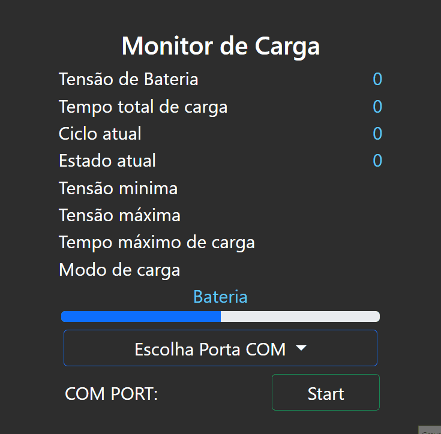
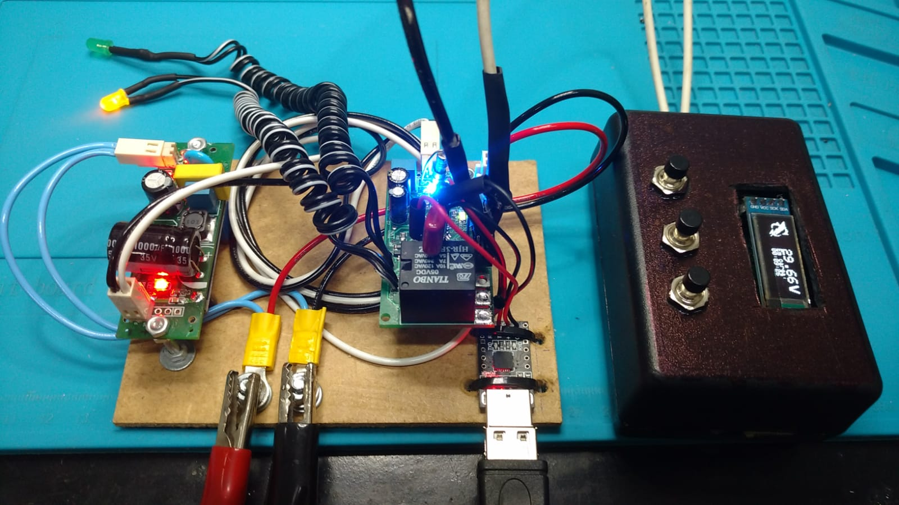
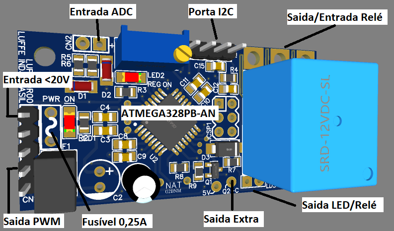

# Projetos de Sistemas Embarcados C / C++

Projetos desenvolvidos também com layout PCB e esquema elétrico.

Trabalhando atualmente em :
- Sistema - MUF800R00
- Versão atual - V4 Serial :
  - Automático 12v/24v/36v/48v
  - Tracionário 12v/24v/36v/48v
  - Bloqueador 12v/24v/36v/48v 

Sistemas desenvolvidos para uso industrial.
- MUF800R00: -> Sistema alvo Arduino -> WIP saida JSON
  - Sistema de automação simples, com disponibilidade de acoplamento em outros sistemas.
  - Sistema de controle por tensão
  - Sistema de medição ADC
  - Sistema de controle automatizado geral
- MUF700R00: -> Sistema alvo Arduino
  - Sistema de controle PWM para resistencias de aquecedores, porém usadas em outra finalidade em ambiente industrial e com baterias
- PSU100R00: -> Fonte de alimentação

MUF800R00

